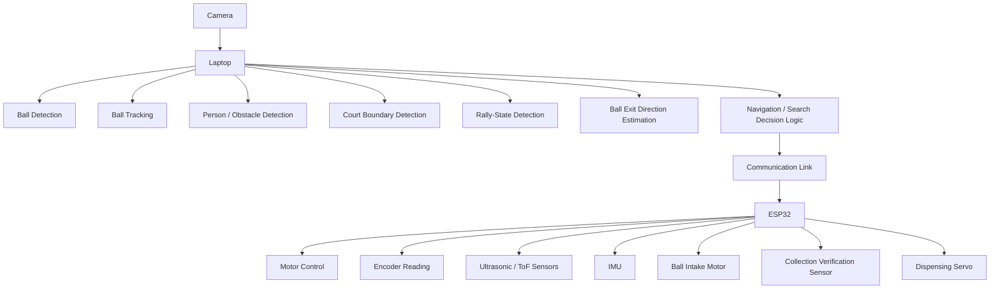
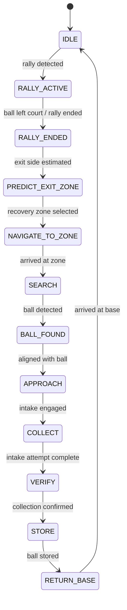
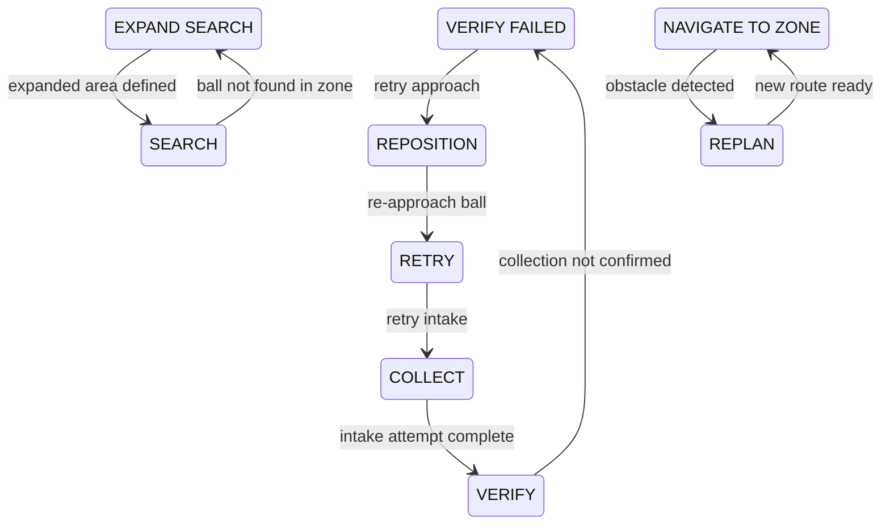
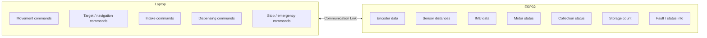
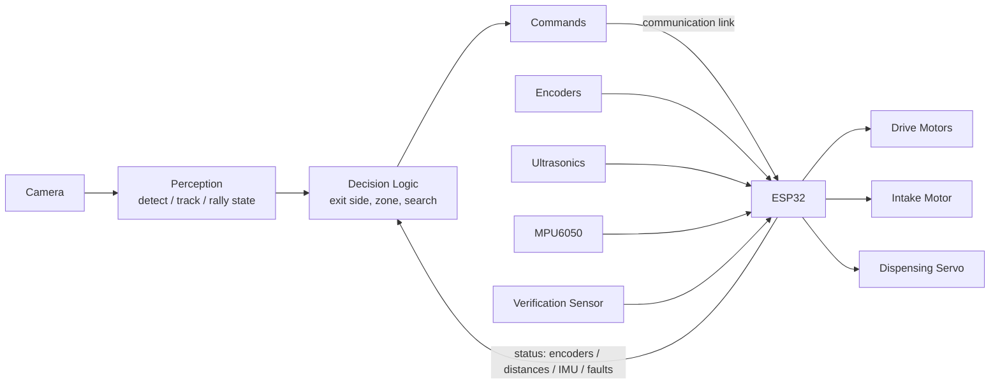

# AI-Sports-Ball-Recovery-Robot — System Architecture

**Version:** 0.1 (draft)
**Status:** Proposed for team review
**Scope:** MVP architecture for a 5-person university semester project (~3 months)

This document is the team's official architecture specification. It defines the agreed system structure, module boundaries, responsibilities, and the MVP scope. It deliberately does **not** contain implementation code or a finalized communication protocol — those are covered by separate documents (see [Communication Boundary](#10-communication) and [Open Technical Decisions](#open-technical-decisions)).

---

## 1. High-Level System

The robot is a two-computer system: a **laptop** handles all computationally expensive perception and decision-making, and an **ESP32** handles real-time, low-level robot control. They communicate over a single link.



```
Camera
   ↓
Laptop
   ├── Ball Detection
   ├── Ball Tracking
   ├── Person/Obstacle Detection
   ├── Court Boundary Detection
   ├── Rally-State Detection
   ├── Ball Exit Direction Estimation
   └── Navigation/Search Decision Logic
          ↓
     Communication Link
          ↓
        ESP32
          ├── Motor Control
          ├── Encoder Reading
          ├── Ultrasonic/ToF Sensors
          ├── IMU
          ├── Ball Intake Motor
          ├── Collection Verification Sensor
          └── Dispensing Servo
```

---

## 2. Laptop Responsibilities

The laptop runs all computationally expensive software and AI tasks:

- **Computer vision** — processing the camera feed
- **Object detection** — balls, people, and other obstacles
- **Ball tracking** — following the ball across frames
- **Rally monitoring** — understanding when a rally is active vs. ended
- **Court/boundary understanding** — knowing where the court and its boundaries are
- **Exit-side estimation** — determining which direction the ball left the court
- **High-level navigation decisions** — choosing recovery zones and search behavior
- **Search-zone selection** — picking and expanding search areas
- **Path-planning decisions where appropriate** — high-level routing decisions (low-level motor control stays on the ESP32)
- **System state coordination** — running the robot state machine

## 3. ESP32 Responsibilities

The ESP32 handles real-time robot control and low-level feedback:

- **Left/right motor control** — differential drive outputs
- **Encoder reading** — wheel rotation feedback
- **Motor speed control** — closed-loop speed regulation
- **Ultrasonic/ToF sensor readings** — proximity and obstacle distances
- **IMU readings** — MPU6050 orientation data
- **Intake motor control** — front roller-based ball intake
- **Collection verification** — sensing whether a ball was actually collected
- **Dispensing servo** — releasing stored balls
- **Emergency-stop handling** — immediate stop on e-stop signal or command
- **Receiving commands from laptop** — movement, intake, dispensing, stop
- **Sending sensor/robot status back to laptop** — encoders, distances, IMU, motor and storage status

The ESP32 does **not** run high-level decision logic; it executes commands and reports status.

## 4. Robot Movement

The robot uses a **4-wheel differential-drive** configuration:

- Four fixed wheels
- Left motors controlled as one side, right motors as one side
- No mecanum wheels
- No mechanical steering
- No robotic arm

Movement is therefore limited to forward/backward and rotation (turn-in-place). All path planning must respect this constraint. The robot has no way to strafe; navigation plans must be composed of arcs and turns only.

## 5. Sensors

**Baseline sensors (MVP-required):**

| Sensor | Purpose |
|---|---|
| Front-facing camera (laptop) | Ball/obstacle detection, tracking, rally and court perception |
| Wheel encoders | Odometry, speed feedback |
| MPU6050 IMU | Orientation and heading |
| 3–4 ultrasonic sensors | Proximity and obstacle detection around the robot |

**Optional (not required for MVP):**
- VL53L0X / ToF sensors may be introduced later as an improvement for more precise short-range distance measurement. They must **not** be required for the MVP to work.

## 6. Ball Collection

Collection uses a passive mechanical approach with verification:

- **Front roller-based intake** — driven by the intake motor
- **Guide plates / funnel** — guide the ball into the intake
- **Collection verification sensor** — confirms the ball actually entered the storage path
- **Storage bin** — holds collected balls

The system must be able to detect whether a ball was actually collected (verification), and treat "not verified" as a failed attempt that triggers retry behavior (see [State Machine](#9-robot-state-machine)).

## 7. Ball Dispensing

The robot stores collected tennis balls and can return them to players:

1. When replenishment is requested, the robot positions itself at the designated dispensing location.
2. A **servo-controlled gate** releases one ball.
3. The system updates its stored-ball count.

Dispensing is a base-station feature: it happens at the designated location, not in the middle of the field.

## 8. Operating Environment

The MVP is **not** unrestricted indoor autonomous navigation. Define the operating environment as:

- **One sports court** (e.g., a single tennis court)
- Its **surrounding designated recovery areas**
- **Known/limited operating boundaries** — the robot's permitted area is predefined
- **Dynamic obstacles** — people, chairs, tables, bags may appear and move

The robot must remain within the defined operating area at all times. Court boundary detection and the predefined boundaries together keep the robot inside its permitted region. During an active rally, the robot stays in a safe/home position and does not move onto the court.

## 9. Robot State Machine

The system is coordinated by a single top-level state machine running on the laptop. The ESP32 stays in a command/status loop underneath it.

**Primary flow:**



**Failure / recovery transitions:**



**Safety behavior:**
- **Safe/home position:** during `RALLY_ACTIVE` the robot stays parked at its safe/home position and does not move.
- **Emergency stop:** an e-stop signal (physical or via command) stops the robot immediately from any state. Recovery requires explicit re-arming/reset before returning to `IDLE`.
- **Retry limits:** failed collections have a maximum retry count; if exhausted, the robot falls back to `SEARCH` (the ball may have been displaced) and eventually returns to base with a status report.

## 10. Communication

Laptop ↔ ESP32 communication crosses a single boundary. **The detailed protocol (message format, framing, timing) is deliberately not specified in this document** — it will be defined in a separate protocol specification before implementation.

The categories of information that must cross the boundary:

**Laptop → ESP32:**
- Movement commands
- Target/navigation commands
- Intake commands
- Dispensing commands
- Stop/emergency commands

**ESP32 → Laptop:**
- Encoder data
- Sensor distances
- IMU data
- Motor status
- Collection status
- Storage count
- Fault/status information



**Working assumption:** the link is a USB serial connection between laptop and ESP32 (details, framing, and rates are open — see [Open Technical Decisions](#open-technical-decisions)).

## 11. Modules

The system is divided into three major technical modules. Each module maps to a repository directory and is owned by specific team members (see [Team Responsibilities](#12-five-person-team-responsibilities)).

### Module 1 — AI Game & Environment Perception (`ai/`)

- Ball detection
- Object/obstacle detection (people, chairs, tables, bags)
- Ball tracking
- Court boundary detection
- Rally detection
- Ball exit direction estimation

### Module 2 — Autonomous Navigation & Intelligent Search (`navigation/`)

- Localization (odometry from encoders + IMU heading)
- Movement control
- Path planning
- Obstacle avoidance
- Dynamic rerouting
- Recovery-zone targeting
- Intelligent search (search patterns within a zone)
- Search expansion (widening the area when the ball is not found)
- Return-to-base

### Module 3 — Ball Acquisition, Storage & Replenishment (`firmware/`, `mechanical/`)

- Intake mechanism (front roller, guide plates)
- Collection verification
- Storage (bin, capacity tracking)
- Ball dispensing (servo gate)
- Collection/recovery retry behavior

## 12. Five-Person Team Responsibilities

| # | Role | Responsibilities |
|---|---|---|
| 1 | **System Architecture & Integration Lead** | Overall architecture; module interfaces; laptop↔ESP32 integration; state machine; system integration; end-to-end testing; search/recovery coordination |
| 2 | **AI & Computer Vision** | Dataset; ball/object detection; tracking; court perception; rally detection; exit prediction |
| 3 | **Navigation & Robotics Software** | Localization; path planning; obstacle avoidance; navigation logic; search algorithms |
| 4 | **Mechanical Engineering** | Chassis; intake mechanism; storage mechanism; dispensing mechanism; mechanical fabrication |
| 5 | **Embedded Systems & Electronics** | ESP32 firmware; motor drivers; motors; encoders; sensors; battery/power; embedded communication |

**Indicative 3-month phasing (to be refined by the team):**

| Phase | Focus |
|---|---|
| Month 1 | Module foundations: ball detection, ESP32 motor/encoder/sensor bring-up, chassis + intake fabrication, comms link |
| Month 2 | Rally perception + exit estimation; navigation, obstacle avoidance, search; intake + verification working on the bench |
| Month 3 | Integration of all modules, field testing on the court, recovery/retry behavior, dispensing, end-to-end demo |

## 13. MVP vs Stretch Goals

### MVP (required for a passing/demo-able system)

- Ball detection
- Rally-end detection
- Exit-side estimation
- Targeted recovery-zone navigation
- Obstacle detection/avoidance
- Ball search
- Physical ball collection
- Collection verification
- Ball storage
- Return to base
- Ball dispensing

### Stretch Goals (explicitly optional — never dependencies for the MVP)

- More precise landing-point prediction
- Better sensor fusion
- More advanced localization
- SLAM
- Improved search optimization
- Dashboard/telemetry

Stretch goals may only be pursued after the MVP works end-to-end.

## 14. Architecture Diagrams

### Overall system

See [High-Level System](#1-high-level-system).

### Robot data flow



### Laptop ↔ ESP32 communication

See [Communication](#10-communication).

### State machine

See [State Machine](#9-robot-state-machine).

## 15. Design Principles

1. **MVP-first** — build the smallest system that completes the core loop: detect exit → navigate → find → collect → verify → store → return. Everything else waits.
2. **Modular development** — the three modules are developed independently in parallel by their owners.
3. **Clear interfaces between team members** — module boundaries are defined up front; members agree on interfaces before integration.
4. **Hardware/software separation where practical** — the laptop and ESP32 have clean, minimal responsibilities and communicate only through the agreed link.
5. **Fail-safe behavior** — e-stop, safe/home position during rallies, retry limits, and defined failure recovery paths.
6. **Test each module independently before integration** — unit-level verification before end-to-end.
7. **Avoid unnecessary complexity** — no features, frameworks, or hardware beyond what is in this document.
8. **No dependence on advanced features before the core robot works** — stretch goals are never prerequisites.

## 16. Explicitly Out of Scope

- No ROS (unless explicitly required later)
- No SLAM as a mandatory requirement
- No robotic arms
- No mecanum wheels
- No unnecessary cloud services
- No unnecessary AI models
- No operating environment beyond the defined sports-court / recovery-zone area

---

## Assumptions

- The court and its surrounding recovery areas are known/predefined; the robot's operating boundary is fixed for the MVP.
- The camera is mounted on the robot (front-facing) and connected to the laptop.
- The laptop and ESP32 are connected by a single communication link (USB serial assumed).
- The ball is a standard tennis ball; the environment is an outdoor or indoor tennis court.
- One ball is handled at a time during collection; multiple balls accumulate in the bin.
- A person is available to observe/operate during tests; full autonomy is limited to the defined court environment.
- The team has access to a 3D printer/shop for mechanical fabrication (chassis, intake, bin, gate).

## Open Technical Decisions

- **Communication transport & message format** — exact framing, payload encoding, and update rates (to be specified in the future protocol document).
- **Ball detection approach** — model choice, dataset source/collection plan (Person 2 to propose).
- **Localization fidelity** — how much odometry/IMU drift is acceptable; whether landmark or boundary cues are used to correct position.
- **Search pattern** — specific search pattern (lawnmower, spiral, sector-based) for recovery zones (Person 3 to propose).
- **Collection verification sensor type** — IR break-beam, reflectance, or other (Person 4/5 to propose).
- **Court boundary representation** — fixed map with manual calibration vs. vision-derived boundaries (Person 2 to propose).
- **State machine execution location** — laptop (default) with ESP32 e-stop override; to be confirmed.

## Interfaces That Need to Be Agreed Before Implementation

1. **Laptop ↔ ESP32 message categories and semantics** — what each command/status means, expected timing (see [Section 10](#10-communication)).
2. **Perception → navigation interface** — the outputs Module 1 provides to Module 2: ball position (image vs. world coordinates), exit direction, rally state, obstacle detections, and their formats.
3. **Navigation → firmware interface** — what the laptop sends to the ESP32 (velocity commands, waypoints, target headings) and what the ESP32 reports back (odometry, distances, IMU, status).
4. **Collection subsystem interface** — the command to run the intake, and the verification/storage status reported back.
5. **State machine events** — the canonical list of events/triggers and who (which module) produces each one.
6. **Coordinate conventions** — world frame, robot frame, image frame origins and units, shared across Modules 1–3.
7. **Emergency-stop semantics** — trigger sources, stop behavior, and re-arm procedure.