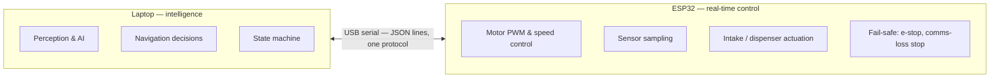

# AI-Sports-Ball-Recovery-Robot — Laptop ↔ ESP32 Communication Protocol

**Version:** 1 (draft)
**Status:** Proposed for team review
**Supersedes:** the open "communication transport & message format" decision in `docs/ARCHITECTURE.md` (§10, Open Technical Decisions)

This document specifies the exact interface between the **laptop** (high-level intelligence) and the **ESP32** (low-level real-time controller). It is a specification only — it contains no implementation code. It is intentionally simple: it must be implementable and debuggable by five people working independently within a 3-month project.

---

## 1. Protocol Overview

The robot is split into two compute nodes with strict, non-overlapping responsibilities (per `docs/ARCHITECTURE.md` §2–§3).

### Laptop owns (high-level intelligence)

- All camera / computer-vision / AI inference (ball detection, tracking, rally state, court boundaries, exit estimation)
- All navigation **decisions**: localization (fusing encoder + IMU data), path planning, obstacle avoidance logic, search-zone selection, rerouting
- The system state machine (IDLE → RALLY_ACTIVE → … → IDLE) and its failure/recovery transitions
- The decision of **when** to move, where to move, and whether to run the intake or dispenser

### ESP32 owns (low-level real-time control)

- Converting movement commands into motor PWM via closed-loop speed control
- Sampling and reporting encoders, ultrasonic distances, and IMU data
- Executing intake and dispensing actions
- Monitoring the collection verification sensor and reporting storage count
- Local, hard fail-safes: emergency stop and communication-loss safe stop

### Explicit non-goals

- **No AI inference on the ESP32.** The ESP32 never detects balls, rallies, obstacles, or boundaries. It never decides where the robot should go.
- The laptop never directly commands individual motor PWM values (see [Movement Interface](#5-movement-interface)).



### Model: command / status

The link is **command/status**, not request/response. The laptop is the master:

- The laptop sends **commands** (move, stop, intake, dispense, reset) and **heartbeats**.
- The ESP32 continuously streams **status** (telemetry at a fixed rate) and pushes **events** (collection result, dispense result, faults).
- Commands that need confirmation are **acknowledged** (OK / error). Telemetry and events are never individually acknowledged.

---

## 2. Transport

| Item | Decision | Rationale |
|---|---|---|
| Connection | **USB serial** between laptop and ESP32 | Simplest possible link; no extra hardware or networking; already assumed by `ARCHITECTURE.md` |
| Baud rate | **115200**, 8 data bits, no parity, 1 stop bit (8N1) | Standard ESP32 default; ~11.5 kB/s is far more than this protocol needs |
| Message boundaries | One message per **line**, terminated by `\n` (LF). A trailing `\r` before `\n` is ignored | Trivially readable in any serial monitor |
| Encoding | **UTF-8 text, JSON**, one compact single-line object per message | Human-debuggable, parseable on both sides with standard tooling; no binary framing to get wrong |
| Maximum message length | 512 bytes per line | Bounds buffer sizes; all defined messages are far smaller |
| Behavior model | Command/status (see §1) | |
| Flow control | None (hardware or software) | MVP traffic is small and one-directional at any moment; see §8 |

Explicitly **not** used: ROS, MQTT, Wi-Fi/Bluetooth networking, cloud services, or any custom binary framing. The ESP32's exact USB/UART bridge wiring is an implementation detail owned by Person 5.

**Timeout expectations (summary — full rules in §7 and §8):**

- ESP32 declares the laptop dead if **no valid message arrives within 1000 ms** → safe stop.
- The laptop declares the ESP32 dead if **no heartbeat or telemetry arrives within 1500 ms** → laptop freezes the state machine.
- A command is considered unanswered if no response arrives within **300 ms**.

**Basic error handling:** a malformed line never crashes either side. Two cases are distinguished:

- **Completely malformed** — the line cannot be parsed and no valid header/`seq` can be recovered (e.g. it is not valid JSON). The receiving side discards it, logs/counts it, and sends **no** `RESP_ERR`.
- **Recoverable header, invalid content** — the message has a valid header/`seq` but an invalid type, version, or field/range. The receiving side responds with the appropriate `RESP_ERR` (see §3 error codes).

Persistent malformed traffic triggers a `PARSE_FLOOD`-style fault only after a repeated threshold — for the MVP, logging and counting is sufficient.

---

## 3. Message Format

**One consistent format for every message on the link.** Every message is a single-line JSON object containing a small fixed header plus a type-specific payload.

### Common header fields (present in **every** message)

| Field | Type | Required | Meaning |
|---|---|---|---|
| `v` | int | always | Protocol version. Must be `1` (see §13) |
| `type` | string | always | Message type, e.g. `"CMD_MOVE"` |
| `seq` | int, 0–65535 | always | Rolling sequence number, incremented by the sender on every message. Used for duplicate detection and acknowledgements |
| `ts` | int (ms) | optional | Sender timestamp. ESP32: milliseconds since boot. Laptop: milliseconds since boot of the laptop process. Useful for latency/dropout analysis; never required for correctness |

### Message catalog

**Laptop → ESP32 (commands):**

| Message | Purpose |
|---|---|
| `HEARTBEAT` | Liveness signal (laptop alive) |
| `CMD_MOVE` | Continuous velocity command (drive the robot) |
| `CMD_STOP` | Stop motion (normal or emergency) |
| `CMD_INTAKE` | Start / stop the ball intake roller |
| `CMD_DISPENSE` | Release one stored ball |
| `CMD_RESET` | Clear latched faults / re-arm after emergency stop |

**ESP32 → Laptop (status, events, responses):**

| Message | Purpose |
|---|---|
| `HEARTBEAT` | Liveness signal (ESP32 alive) |
| `EVT_BOOT` | Sent once on ESP32 startup, reporting boot reason |
| `TELE` | Periodic telemetry: encoders, distances, IMU, motor, collection, storage, faults |
| `EVT_COLLECT` | Result of a collection attempt |
| `EVT_DISPENSE` | Result of a dispensing attempt |
| `EVT_FAULT` | Asynchronous fault report (faults are latched until cleared) |
| `RESP_OK` | Command acknowledged and executed |
| `RESP_ERR` | Command rejected, with a reason code |

### Response model per command

| Laptop command | ESP32 response |
|---|---|
| `HEARTBEAT` | No explicit response (ESP32 heartbeat is independent) |
| `CMD_MOVE` | `RESP_OK` / `RESP_ERR` (response is informative; latest command wins, see §9) |
| `CMD_STOP` | `RESP_OK` / `RESP_ERR` |
| `CMD_INTAKE` | `RESP_OK` / `RESP_ERR`; the outcome is later reported via `EVT_COLLECT` |
| `CMD_DISPENSE` | `RESP_OK` / `RESP_ERR`; the outcome is later reported via `EVT_DISPENSE` |
| `CMD_RESET` | `RESP_OK` / `RESP_ERR` |

### Error codes (in `RESP_ERR.code`)

| Code | Meaning |
|---|---|
| `PARSE` | Line could not be parsed as a valid message |
| `UNKNOWN_TYPE` | Message type is not defined |
| `RANGE` | A field is present but outside its valid range |
| `VERSION` | `v` does not match the supported protocol version |
| `NOT_READY` | ESP32 is not in READY state — still completing startup checks, or latched after e-stop / comms-loss — and will not execute the command |
| `BUSY` | ESP32 cannot execute right now (e.g. intake requested while already dispensing) |
| `INTERNAL` | Any other ESP32-side failure |

---

## 4. Message Schemas

### 4.1 Laptop → ESP32

#### `HEARTBEAT` — liveness

- Sender: laptop — Receiver: ESP32
- Required fields: none beyond the header
- Optional fields: `ts`
- Example:
  ```json
  {"v":1,"type":"HEARTBEAT","seq":142,"ts":7100}
  ```
- Semantics: sent every 500 ms (see §8). Any valid incoming message also counts toward laptop liveness, but the heartbeat is the guaranteed signal.

#### `CMD_MOVE` — continuous velocity command

- Sender: laptop (produced by the Navigation module) — Receiver: ESP32
- Required fields:

| Field | Type | Range | Meaning |
|---|---|---|---|
| `lin` | float | −1.0 … 1.0 | Linear velocity demand. Positive = forward, negative = backward. Fraction of the robot's configured maximum linear speed |
| `ang` | float | −1.0 … 1.0 | Angular velocity demand. Positive = rotate counter-clockwise (left), negative = clockwise (right), viewed from above. Fraction of the robot's configured maximum angular speed |

- Optional fields: none
- Semantics: **latest command wins.** The robot keeps executing the most recent `CMD_MOVE` until a new `CMD_MOVE` or `CMD_STOP` arrives. The ESP32 derives per-side demands and performs closed-loop speed control; the laptop never sends PWM values (per `ARCHITECTURE.md` §4 differential drive: left = `lin − ang`, right = `lin + ang`, each clamped to [−1, 1]).
- `lin = 0, ang = 0` is equivalent to a normal stop, but `CMD_STOP` is the explicit, preferred way to stop.
- Valid range exceeded (e.g. `lin: 1.5`) → `RESP_ERR` `RANGE`, previous motion command stays in force.
- Example:
  ```json
  {"v":1,"type":"CMD_MOVE","seq":150,"lin":0.6,"ang":0.0}
  ```
  Robot drives forward at 60 % of max linear speed.
  ```json
  {"v":1,"type":"CMD_MOVE","seq":151,"lin":0.0,"ang":0.8}
  ```
  Robot rotates counter-clockwise at 80 % of max angular speed.

#### `CMD_STOP` — stop motion

- Sender: laptop — Receiver: ESP32
- Required fields:

| Field | Type | Range | Meaning |
|---|---|---|---|
| `mode` | string | `normal` \| `emergency` | `normal`: decelerate and stop motors; `emergency`: immediate hard stop (see §7) |

- `mode` defaults to `normal` if omitted.
- Semantics: `normal` returns to the safe motor state (motors stopped, drive enabled for future commands). `emergency` latches the e-stop condition and requires `CMD_RESET` before any further motion.
- Example:
  ```json
  {"v":1,"type":"CMD_STOP","seq":160,"mode":"emergency"}
  ```

#### `CMD_INTAKE` — intake roller control

- Sender: laptop (state machine orchestration) — Receiver: ESP32
- Required fields:

| Field | Type | Range | Meaning |
|---|---|---|---|
| `action` | string | `start` \| `stop` | `start`: run intake roller; `stop`: stop the roller now |

- Semantics: when `action: start` is executed, the ESP32 runs the roller and watches the collection verification sensor. The roller **auto-stops when a ball is detected passing through** and the ESP32 emits `EVT_COLLECT` with `status: collected`. If `action: stop` arrives first (no ball seen during the run), the ESP32 emits `EVT_COLLECT` with `status: failed`. One `EVT_COLLECT` per intake run.
- Example:
  ```json
  {"v":1,"type":"CMD_INTAKE","seq":170,"action":"start"}
  ```

#### `CMD_DISPENSE` — release stored ball

- Sender: laptop — Receiver: ESP32
- Required fields:

| Field | Type | Range | Meaning |
|---|---|---|---|
| `count` | int | 1 … 10 | Number of balls to release (MVP usage is always `1`) |

- Semantics: the ESP32 opens the servo gate once per ball, waits for the ball to drop, and closes it. The result is reported via `EVT_DISPENSE`. The ESP32 rejects the command with `RESP_ERR` `BUSY` if it is mid-dispense or mid-intake.
- Example:
  ```json
  {"v":1,"type":"CMD_DISPENSE","seq":180,"count":1}
  ```

#### `CMD_RESET` — clear faults / re-arm

- Sender: laptop — Receiver: ESP32
- Required fields:

| Field | Type | Range | Meaning |
|---|---|---|---|
| `scope` | string | `faults` \| `all` | `faults`: clear non-latching faults; `all`: additionally re-arm after an emergency stop or comms-loss latch |

- Semantics: after an e-stop or communication-loss safe stop, the ESP32 latches `NOT_READY` and ignores motion/intake/dispense commands until it receives `CMD_RESET` with `scope: all`. A `RESP_OK` confirms the ESP32 is armed again.
- Example:
  ```json
  {"v":1,"type":"CMD_RESET","seq":190,"scope":"all"}
  ```

### 4.2 ESP32 → Laptop

#### `HEARTBEAT` — liveness

- Sender: ESP32 — Receiver: laptop
- Required fields: none beyond the header
- Example:
  ```json
  {"v":1,"type":"HEARTBEAT","seq":77,"ts":41200}
  ```

#### `EVT_BOOT` — startup announcement

- Sender: ESP32 — Receiver: laptop
- Required fields:

| Field | Type | Range | Meaning |
|---|---|---|---|
| `reason` | string | `poweron` \| `watchdog` \| `reset` | Why the ESP32 restarted |

- Optional fields: `fw` (string, firmware version label), `ts`
- Semantics: sent once, immediately after boot, before telemetry starts. Tells the laptop that the ESP32 has successfully booted and reports its protocol/firmware information — which protocol version it speaks (`v` in the header) and its firmware label (`fw`). READY status is established separately, after the ESP32 completes its startup checks (§7, Startup behavior / READY state).
- Example:
  ```json
  {"v":1,"type":"EVT_BOOT","seq":1,"reason":"poweron","fw":"mvp-0.1"}
  ```

#### `TELE` — periodic telemetry (the main status message)

- Sender: ESP32 — Receiver: laptop
- Sent at **20 Hz** (every 50 ms) while powered.
- Required fields:

| Field | Type | Meaning |
|---|---|---|
| `enc` | object | Encoder deltas since the previous `TELE`: `{"dl": int, "dr": int}` in raw encoder counts. Left/right. Negative = reverse. Deltas (not cumulative) keep values small and overflow-proof |
| `us` | array of 4 ints | Ultrasonic distances in mm: `[front_left, front_right, left, right]` (order fixed; exact mount positions per chassis — see Open Decisions). Value semantics: **0–4000** = valid distance in mm; **9999** = no echo (out of range); **−1** = sensor fault |
| `imu` | object | `{"ax","ay","az"}` in g, `{"gx","gy","gz"}` in deg/s (MPU6050, ESP32-scaled, unfiltered). Optional field `yaw` (deg, −180…180) only if Person 5 later adds onboard heading estimation — see Open Decisions |
| `mot` | object | `{"pwm_l","pwm_r"}` ints −100…100 (commanded drive duty per side); `{"spd_l","spd_r"}` floats in % of max (measured from encoders, 0 when stopped) |
| `collect` | object | `{"trip": bool, "state": string}` — `trip` = collection verification sensor currently blocked (ball present in the intake path); `state` = `idle` \| `running` (intake roller state) |
| `balls` | object | `{"count": int, "full": bool}` — stored-ball count (ESP32-authoritative, see §10) and full-bin flag |
| `faults` | array of ints | Active fault codes (empty array `[]` = no faults). Codes in §7 table |

- Optional fields: `ts` (should be populated by the ESP32: ms since boot).
- The laptop uses `enc` + `imu` for its own odometry/heading estimate (`ARCHITECTURE.md` Module 2), and `us` for obstacle detection logic. Obstacle *decisions* stay on the laptop; the ESP32 only enforces one hard local stop rule (§7).
- Example:
  ```json
  {"v":1,"type":"TELE","seq":88,"ts":44050,"enc":{"dl":14,"dr":13},"us":[350,340,9999,410],"imu":{"ax":0.02,"ay":0.01,"az":0.99,"gx":0.5,"gy":-0.2,"gz":1.4},"mot":{"pwm_l":45,"pwm_r":44,"spd_l":44.2,"spd_r":43.8},"collect":{"trip":false,"state":"idle"},"balls":{"count":3,"full":false},"faults":[]}
  ```

#### `EVT_COLLECT` — collection attempt result

- Sender: ESP32 — Receiver: laptop
- Required fields:

| Field | Type | Range | Meaning |
|---|---|---|---|
| `status` | string | `collected` \| `failed` | Whether a ball was verified during the intake run |
| `balls` | object | — | Storage state after the attempt: `{"count": int, "full": bool}` |

- Emitted once per intake run (see `CMD_INTAKE`). On `collected`, the ESP32 has already incremented its stored-ball count.
- Examples:
  ```json
  {"v":1,"type":"EVT_COLLECT","seq":95,"ts":46310,"status":"collected","balls":{"count":4,"full":false}}
  ```
  ```json
  {"v":1,"type":"EVT_COLLECT","seq":99,"ts":47020,"status":"failed","balls":{"count":4,"full":false}}
  ```

#### `EVT_DISPENSE` — dispensing result

- Sender: ESP32 — Receiver: laptop
- Required fields:

| Field | Type | Range | Meaning |
|---|---|---|---|
| `status` | string | `ok` \| `failed` \| `empty` | `ok`: ball released and count decremented; `failed`: mechanism error or timeout; `empty`: bin had no ball |
| `balls` | object | — | Storage state after the attempt |

- Examples:
  ```json
  {"v":1,"type":"EVT_DISPENSE","seq":103,"ts":61200,"status":"ok","balls":{"count":2,"full":false}}
  ```
  ```json
  {"v":1,"type":"EVT_DISPENSE","seq":104,"ts":61800,"status":"empty","balls":{"count":0,"full":false}}
  ```

#### `EVT_FAULT` — asynchronous fault report

- Sender: ESP32 — Receiver: laptop
- Required fields:

| Field | Type | Range | Meaning |
|---|---|---|---|
| `code` | int | 1 … 9 | Fault code (table below) |

- Optional fields: `info` (short human-readable string, e.g. `"front-left ultrasonic"`)
- Faults are **latched**: once raised, the code stays in `TELE.faults` until cleared (see §7).
- Example:
  ```json
  {"v":1,"type":"EVT_FAULT","seq":110,"ts":52100,"code":3,"info":"forward ultrasonic < hard-stop threshold"}
  ```

#### `RESP_OK` — command acknowledged

- Sender: ESP32 — Receiver: laptop
- Required fields:

| Field | Type | Meaning |
|---|---|---|
| `ack` | int | `seq` of the command being acknowledged |

- Example:
  ```json
  {"v":1,"type":"RESP_OK","seq":205,"ack":150}
  ```

#### `RESP_ERR` — command rejected

- Sender: ESP32 — Receiver: laptop
- Required fields:

| Field | Type | Meaning |
|---|---|---|
| `ack` | int | `seq` of the rejected command |
| `code` | string | Error code from the §3 table |

- Optional fields: `msg` (short human-readable string)
- Example:
  ```json
  {"v":1,"type":"RESP_ERR","seq":206,"ack":180,"code":"NOT_READY","msg":"e-stop latched"}
  ```

---

## 5. Movement Interface

The laptop never sends motor PWM values. It sends **normalized velocity demands**; the ESP32 owns all low-level motor control (`ARCHITECTURE.md` §3, §4).

| Robot behavior | `CMD_MOVE` payload | Notes |
|---|---|---|
| Forward | `lin: 0.6, ang: 0.0` | Both sides forward |
| Backward | `lin: -0.4, ang: 0.0` | Both sides reverse |
| Turn left (CCW) | `lin: 0.0, ang: 0.8` | Differential rotation in place |
| Turn right (CW) | `lin: 0.0, ang: -0.8` | Differential rotation in place |
| Curve forward-left | `lin: 0.5, ang: 0.3` | Differential drive combination |
| Curve forward-right | `lin: 0.5, ang: -0.3` | Differential drive combination |
| Stop | `CMD_STOP mode: normal` | Explicit stop preferred |

**Speed control contract:**

- Maximum linear and angular speeds are configured constants on the ESP32 (calibrated per robot — see Open Decisions). The laptop only ever sends fractions in [−1, 1].
- The ESP32 runs closed-loop speed control per side using encoder feedback (Person 5 firmware), smoothing transitions so commands are executed smoothly.
- Commands are continuous: the robot holds the last `CMD_MOVE` until a newer one or a stop. The laptop's navigation loop naturally streams new `CMD_MOVE` values (target ≤ 20 Hz, see §8).
- This interface is deliberately identical whether the robot is navigating to a recovery zone, searching, approaching a ball, or returning to base — those are all laptop-side decisions expressed through the same two floats.

---

## 6. Sensor / Status Interface

Everything the ESP32 reports flows through `TELE` (periodic) and the event messages (asynchronous). Field-by-field semantics are in §4.2; this section summarizes how the laptop consumes them.

| Data | Where | Consumed by |
|---|---|---|
| Left/right encoder deltas | `TELE.enc.dl/dr` | Person 3 localization (odometry); the laptop integrates deltas into its pose estimate and derives wheel velocities from the 50 ms period |
| Ultrasonic distances (×4) | `TELE.us` | Person 3 obstacle detection/avoidance logic. Distances are raw; obstacle *decisions* are laptop-side |
| IMU acceleration / gyro | `TELE.imu` | Person 3 heading estimation. Raw unfiltered values; filtering/fusion is laptop-side localization |
| Motor state | `TELE.mot` (`pwm_l/pwm_r`, `spd_l/spd_r`) | Laptop monitors that motion commands are actually being executed (motor stall / mismatch detection) |
| Obstacle status | Derived on laptop from `TELE.us` + camera | No separate message needed. The ESP32's only obstacle behavior is the hard local stop rule (§7), reported via `EVT_FAULT` code 3 |
| Collection sensor | `TELE.collect.trip` (live), `EVT_COLLECT` (result) | Person 1 state machine (VERIFY / retry decisions) |
| Storage count | `TELE.balls.count`, echoed in `EVT_COLLECT` / `EVT_DISPENSE` | Laptop tracking and dispensing decisions |
| Faults | `TELE.faults`, `EVT_FAULT` | Laptop state machine (fault handling) |

---

## 7. Safety

The robot must fail safe. Order of priority on the ESP32 (highest first):

1. **Physical emergency stop** — a hardware e-stop switch wired to an ESP32 interrupt pin. When pressed: motors and intake stop immediately, servo gate is not actuated, fault code **1** latches, and the ESP32 reports `NOT_READY` until a `CMD_RESET` `scope: all` arrives. Independent of the laptop and of the serial link.
2. **Laptop emergency command** — `CMD_STOP` with `mode: emergency`. Same behavior as the physical e-stop (latch + fault code **1**), so an operator or the laptop's own logic can trigger a latched stop remotely.
3. **Communication-loss safe stop** — if the ESP32 receives **no valid message for 1000 ms**, it stops all motion and the intake, latches fault code **2** (`COMMS_LOST`), and remains in `NOT_READY`. A returning `HEARTBEAT` or any other incoming message does **not** clear the latch. The ESP32 stays latched until it receives `CMD_RESET` with `scope: all`; only after that reset/re-arm sequence are new motion commands accepted (the ESP32 never re-applies a pre-loss command on its own).
4. **Local obstacle hard stop** — if the ESP32 has a valid forward ultrasonic reading below the hard-stop threshold (default **150 mm**, calibrated in testing) while a forward motion command is active, it stops motion, raises fault code **3**, and reports it. This is a *safety stop only* — the ESP32 does not avoid or replan; the laptop handles recovery with a new route. (Threshold and which sensors count as "forward" are Open Decisions.)
5. **Sensor faults** — a faulted ultrasonic (reported as `−1`) or a failed IMU read raises fault code **4** / **5** in `TELE.faults` and `EVT_FAULT`. The ESP32 does **not** perform the local obstacle hard stop using a faulted sensor (an unknown distance is not treated as "clear"). Whether the robot may keep moving under laptop command with a faulted sensor is the laptop's decision; the laptop is expected to slow down or stop when a sensor relevant to its current motion is faulted.
6. **Motor/control fault** — if the ESP32 detects a motor, encoder, or drive-control failure (e.g. lost encoder feedback or a motor-driver fault), it stops the affected drive safely, latches fault code **6** (`MOTOR_FAULT`), and reports it. The exact detection thresholds are an implementation/calibration decision, not part of this protocol.

**Other rules:**

- **Invalid / out-of-range commands** are rejected with `RESP_ERR` and do not change any actuator state (the previous motion command stays in force).
- **Startup behavior / READY state:** after boot, the ESP32 starts in the safe motor state: drive motors and intake off, dispense gate closed, no motion. It sends `EVT_BOOT` and begins telemetry, then runs its startup checks (sensor / IMU / motor-driver initialization) before entering the **READY** state. Until READY is reached, the ESP32 must not execute motion, intake, or dispense commands — it rejects them with `RESP_ERR` `NOT_READY`. The laptop must still wait for `EVT_BOOT` plus healthy `TELE` frames with no active faults before commanding the robot; commands sent too early are safely rejected.
- **Safe motor state** is defined as: drive motors stopped (zero velocity demand), intake roller off, dispense gate closed. All faults and stops return the robot to this state.
- **Intake/dispense mutual exclusion:** the ESP32 rejects one while the other is running (`RESP_ERR` `BUSY`).
- **Laptop side:** if the laptop receives no `HEARTBEAT` or `TELE` for 1500 ms, it treats the ESP32 as lost: it freezes the state machine, stops issuing commands, keeps sending `HEARTBEAT` + a `CMD_STOP` `emergency` for at most a few seconds, and raises a local fault for the operator.

---

## 8. Timing

Reasonable, achievable MVP expectations. All rates are steady-state; jitter of ±20 % is acceptable and must not break any logic.

| Item | Value | Notes |
|---|---|---|
| Telemetry (`TELE`) rate | **20 Hz** (50 ms period) | Bounded by ESP32 loop; 50 ms is easy at 115200 baud |
| Heartbeat interval (both directions) | **500 ms** | Independent timers per side |
| Command response time (ESP32) | ≤ 20 ms typical | Response is sent on the next control loop tick |
| Command timeout (laptop waits for a response) | **300 ms** | Above this, retransmit once, then treat as comms failure |
| Laptop liveness timeout (on ESP32) | **1000 ms** without any valid message | → comms-loss safe stop (§7) |
| ESP32 liveness timeout (on laptop) | **1500 ms** without heartbeat/telemetry | → laptop freezes state machine (§7) |
| Max laptop command rate | **20 Hz** (one command per 50 ms) | Matches telemetry; never flood the ESP32 |
| Hard-stop obstacle threshold | 150 mm (default) | Calibrated in testing, see Open Decisions |
| Serial line capacity check | Worst case ~300-byte `TELE` at 20 Hz + heartbeats ≈ **6.5 kB/s** | Well under ~11.5 kB/s available at 115200 |

**Rule:** no timeout or period in this document may be interpreted as "real-time critical." Missing one telemetry frame, one heartbeat, or a slightly late response is normal and must never cause a fault by itself — only the liveness timeouts above do.

---

## 9. Reliability

Deliberately lightweight — this is a serial link between two devices the team controls, not a network protocol.

- **Sequence numbers (`seq`):** every message carries a rolling 0–65535 `seq`, incremented per sender. Used for duplicate detection and acknowledgements. Wraparound is handled naturally: only "the last received `seq`" is ever compared.
- **Acknowledgements:** only commands are acknowledged (`RESP_OK` / `RESP_ERR`, echoing the command's `seq` in `ack`). Telemetry, events, and heartbeats are never acknowledged — drops are acceptable because telemetry repeats at 20 Hz and events are loss-tolerant at the state-machine level (the laptop can always recover current state from subsequent periodic `TELE` frames).
- **Duplicate command handling:** the ESP32 remembers the `seq` of the last executed command. If the same `seq` with the same `type` arrives again (laptop retransmission), the ESP32 does **not** re-execute; it re-sends the stored response. This prevents, e.g., a double-dispense on a retransmitted `CMD_DISPENSE`.
- **Latest-wins for continuous commands:** `CMD_MOVE` is stateless with respect to execution — a retransmitted old move command is harmless because the laptop always follows with fresh commands. Duplicate suppression still applies.
- **Invalid-message handling:** a completely malformed message (no valid header/`seq` recoverable) is discarded, logged, and counted **without** sending `RESP_ERR`. A message with a valid header/`seq` but an invalid type, version, or field/range is answered with the matching `RESP_ERR` (`PARSE` / `UNKNOWN_TYPE` / `RANGE` / `VERSION`). The link never resets because of one bad line.
- **Timestamps (`ts`):** optional, defined, and cheap to include. Useful for measuring latency and confirming the ESP32 loop is healthy; never required for correctness.
- **What we deliberately do NOT add:** checksums/CRCs (serial is reliable at short distance and 115200 baud, and a JSON parse failure is already detected), retransmission windows, sliding windows, or message queues. If systematic corruption ever appears, the first step is to fix the physical link, not to extend this protocol.

---

## 10. Storage / Collection Interface

### Collection (intake)

1. Laptop (state machine in `COLLECT`/`APPROACH`) sends `CMD_INTAKE action: start`.
2. ESP32 runs the intake roller and monitors the verification sensor (`TELE.collect.trip` goes live at 20 Hz).
3. **Success path:** sensor trips (ball passed through) → ESP32 auto-stops the roller, increments `balls.count`, emits `EVT_COLLECT status: collected` (+ `RESP_OK` to the start command).
4. **Failure path:** laptop sends `CMD_INTAKE action: stop` before any trip → ESP32 stops the roller and emits `EVT_COLLECT status: failed`. The laptop state machine then decides `REPOSITION` → `RETRY` or fallback to `SEARCH` (`ARCHITECTURE.md` §9), and the count is unchanged.
5. The ESP32's `balls.count` is **authoritative**; the laptop may keep its own copy but must reconcile from `TELE.balls` / the event payloads.

### Dispensing

1. Laptop (state machine, at the designated dispensing location) sends `CMD_DISPENSE count: 1`.
2. ESP32 checks `balls.count > 0`; if not → `RESP_ERR` + `EVT_DISPENSE status: empty`.
3. Otherwise the servo gate opens, releases one ball, closes; `balls.count` decrements; `EVT_DISPENSE status: ok` is emitted.
4. If the mechanism times out or the sensor logic indicates no ball dropped → `EVT_DISPENSE status: failed`, count unchanged, fault code **9** (dispense mechanism) raised.
5. Mutual exclusion with the intake applies (see §7).

---

## 11. Example Communication Flows

All examples are abbreviated JSON (headers trimmed to the essentials).

### A. Robot startup

```
Laptop              ESP32
  |  HEARTBEAT        |
  |------------------>|     (laptop comes online, starts heartbeats)
  |                   | EVT_BOOT reason=poweron
  |<------------------|
  |                   | TELE ... (faults:[])   → telemetry at 20 Hz begins
  |  HEARTBEAT        |
  |------------------>|
  |  CMD_MOVE         |     (only after laptop has seen EVT_BOOT + healthy TELE)
  |------------------>|
  |                   | RESP_OK ack=<seq>
  |<------------------|
```

### B. Laptop commands robot forward

```
Laptop              ESP32
  | CMD_MOVE lin=0.5,ang=0  |
  |------------------------>|
  |                         | RESP_OK
  |<------------------------|
  |                         | TELE enc={dl:+6,dr:+6} mot={pwm:45}   (robot moving)
  |<------------------------|
  | CMD_MOVE lin=0.5,ang=0  |   ... navigation loop streams at ≤20 Hz
  |------------------------>|
  | CMD_STOP mode=normal    |     (zone reached)
  |------------------------>|
  |                         | RESP_OK
  |<------------------------|
```

### C. Obstacle detected

```
Laptop              ESP32
  | CMD_MOVE lin=0.6,ang=0 |
  |----------------------->|
  |                        |  (robot drives forward; ultrasonic drops)
  |                        | EVT_FAULT code=3   ← local hard stop triggered
  |<-----------------------|
  |                        | TELE us=[80,90,...] mot={pwm:0} faults:[3]
  |<-----------------------|
  | CMD_MOVE lin=0.0,ang=0 |  (laptop stops and replans a route)
  |----------------------->|
```

### D. Ball collection

```
Laptop              ESP32
  | CMD_INTAKE action=start |
  |------------------------>|
  |                         | RESP_OK
  |<------------------------|
  |                         | TELE collect={trip:true,state:running}
  |<------------------------|        (ball enters intake)
  |                         | EVT_COLLECT status=collected balls={count:4}
  |<------------------------|        (roller auto-stopped, count incremented)
  | CMD_MOVE ...           |        (laptop proceeds to RETURN_BASE)
  |------------------------>|
```

### E. Ball dispensing

```
Laptop              ESP32
  | CMD_DISPENSE count=1 |
  |---------------------->|
  |                       | RESP_OK
  |<----------------------|
  |                       | EVT_DISPENSE status=ok balls={count:2}
  |<----------------------|
  |                       |   (laptop updates stored-ball count)
```

### F. Laptop / ESP32 communication loss

```
Laptop              ESP32
  | (serial cable unplugged / laptop crash)
  |                   ESP32 sees no message for 1000 ms
  |                   → stops motors, intake off
  |                   → EVT_FAULT code=2 (COMMS_LOST)   [cannot be delivered]
  |                   → latched NOT_READY; requires CMD_RESET scope=all
  |
  | (link restored)
  | HEARTBEAT          |  heartbeat does NOT clear the latch
  |------------------->|  ESP32 stays NOT_READY, safe motor state
  | CMD_RESET scope=all|
  |------------------->|  re-arm: COMMS_LOST cleared, ESP32 READY
  |                   |  RESP_OK
  |<-------------------|
  | CMD_MOVE ...      |  motion accepted only after reset/re-arm
  |------------------->|  robot drives again
```

### G. Emergency stop

```
Laptop              ESP32
  | CMD_STOP mode=emergency |
  |------------------------>|   (or operator presses physical e-stop)
  |                         | motors + intake stop immediately
  |                         | EVT_FAULT code=1  → latched
  |<------------------------|
  |                         | RESP_ERR code=NOT_READY   (to any CMD_MOVE)
  |<------------------------|
  | CMD_RESET scope=all    |   (operator confirms safe to continue)
  |------------------------>|
  |                         | RESP_OK  → armed again
  |<------------------------|
```

---

## 12. Interface Ownership

The protocol is a shared contract. One person owns the contract; everyone implements their side.

| Owner (person) | Owns | In this protocol |
|---|---|---|
| **1 — System Architecture & Integration Lead** | The protocol document itself; schema changes; end-to-end behavior; flow semantics | Message catalog, response model, sequence/duplicate rules, safety semantics, flows A–G, §13 versioning. **Sign-off required for any change to a message schema or a safety rule** |
| **2 — AI & Computer Vision** | Laptop-side consumer of robot status | Reads `TELE` (faults, balls) to keep the state machine coherent; never produces movement commands directly |
| **3 — Navigation & Robotics Software** | Laptop-side **producer** of motion | Generates `CMD_MOVE` / `CMD_STOP` streams from the navigation and search logic; consumes `TELE.enc`, `TELE.imu`, `TELE.us`, `TELE.mot` for localization and obstacle decisions |
| **4 — Mechanical Engineering** | Physical layout assumptions the protocol encodes | Ultrasonic sensor count/positions (`TELE.us` array order), intake/verification sensor placement (`collect.trip`), dispense gate behavior — owns the mechanical constraints Open Decisions must respect |
| **5 — Embedded Systems & Electronics** | ESP32-side implementation of the whole link | Parses/emits all messages; implements response model, duplicate suppression, liveness timers, e-stop latch, hard-stop rule, telemetry generation; owns the serial wiring and the exact USB/UART bridge |

**Change rule:** Person 1 maintains this document. Persons 2, 3, 5 propose changes; Person 4 is consulted whenever a change affects mechanical layout. A schema change requires an updated version per §13 and is only valid once both the laptop and ESP32 implementations are updated together.

---

## 13. Versioning

- The `v` header field is the **protocol version**, currently **1**.
- Both sides must check `v` on incoming messages:
  - ESP32 receiving `v != 1` → ignore the message, reply `RESP_ERR code=VERSION`, raise fault code **8**.
  - Laptop receiving `v != 1` → log incompatibility, freeze the state machine, notify the operator.
- Change policy, from least to most invasive:

| Kind of change | Example | Version handling |
|---|---|---|
| Clarification only | Wording, example fixes | No bump; document only |
| Additive | New optional field, new message type that both sides can safely ignore until updated together | Document the addition; both sides update in the same sprint; `v` stays 1 for the MVP |
| Breaking | Field renamed/removed, value semantics changed, timing/safety rule changed | **Bump `v`**, update the version history below |

- Practical rule for the project: while the team is actively developing, both sides are always updated together from this single document, so version mismatches should not occur — the `v` check exists to catch "old firmware, new laptop" mistakes at the bench, where they are cheap to fix.

**Version history**

| Version | Date | Summary |
|---|---|---|
| 1 | (draft) | Initial specification |

---

## 14. Open Decisions (require physical testing)

These are deliberately not "decided" here — the correct values depend on the real robot and must be resolved on the bench/court before the MVP demo.

1. **Maximum linear/angular speeds and acceleration ramps** — the full-scale values that `lin`/`ang` = ±1 map to, and how aggressively the ESP32 speed controller may ramp. Measure with the real chassis and motors.
2. **Hard-stop obstacle threshold** (default 150 mm) and **which ultrasonic sensors are "forward"** — depends on sensor placement and robot braking distance. 3 vs. 4 ultrasonic sensors also affects `TELE.us` layout; the array is fixed at length 4 with `9999` for unpopulated slots until the mechanical layout is final.
3. **Ultrasonic mount positions and the fixed array order** (`[front_left, front_right, left, right]`) — Person 4 to confirm against the chassis design; the order is frozen once firmware implements it.
4. **Collection verification sensor type and placement**, and the debounce/timing for `collect.trip` — what reliably detects a tennis ball passing the intake without false trips (Person 4/5, bench test with real balls).
5. **Dispense gate open duration and servo behavior** — how long the gate stays open to release exactly one ball reliably; ball-jam detection is out of MVP scope but a `failed` result and fault code 9 are defined.
6. **Encoder calibration** — counts per meter (wheel diameter, gear ratio) and whether 20 Hz encoder deltas give smooth enough velocity for the laptop's odometry.
7. **IMU handling** — whether `yaw` estimation stays purely laptop-side (default) or Person 5 adds a complementary filter on the ESP32 and populates the optional `imu.yaw` field; MPU6050 axis orientation vs. robot frame must be verified once mounted.
8. **E-stop hardware** — switch type (momentary vs. latching), wiring, and interrupt pin; the latch/re-arm semantics in §7 are fixed, the hardware is not.
9. **USB serial specifics** — whether the ESP32 uses its native USB or a UART bridge, cable length, and any observed corruption at 115200 that would justify a lower rate.
10. **Telemetry/command rate adequacy** — confirm 20 Hz telemetry and ≤ 20 Hz commands give stable closed-loop behavior during field navigation; adjust only with a versioned timing change.

---

## Appendix A — Quick Reference

**Header (all messages):** `v` (int, =1), `type` (string), `seq` (int, 0–65535), `ts` (int ms, optional)

**Laptop → ESP32:** `HEARTBEAT` · `CMD_MOVE {lin, ang}` · `CMD_STOP {mode}` · `CMD_INTAKE {action}` · `CMD_DISPENSE {count}` · `CMD_RESET {scope}`

**ESP32 → Laptop:** `HEARTBEAT` · `EVT_BOOT {reason}` · `TELE {enc, us, imu, mot, collect, balls, faults}` · `EVT_COLLECT {status, balls}` · `EVT_DISPENSE {status, balls}` · `EVT_FAULT {code}` · `RESP_OK {ack}` · `RESP_ERR {ack, code}`

**Error codes:** `PARSE` · `UNKNOWN_TYPE` · `RANGE` · `VERSION` · `NOT_READY` · `BUSY` · `INTERNAL`

**Fault codes:** 1 e-stop latched · 2 comms lost · 3 obstacle hard stop · 4 ultrasonic fault · 5 IMU fault · 6 motor fault · 7 (reserved) · 8 protocol version mismatch · 9 dispense mechanism

**Key numbers:** 115200 baud 8N1 · newline-framed JSON · ≤ 512-byte lines · TELE @ 20 Hz · heartbeats @ 500 ms · laptop timeout 1000 ms on ESP32 · ESP32 timeout 1500 ms on laptop · command response ≤ 20 ms · command timeout 300 ms · hard-stop 150 mm default