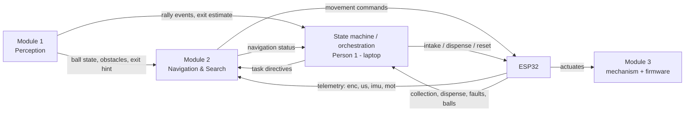
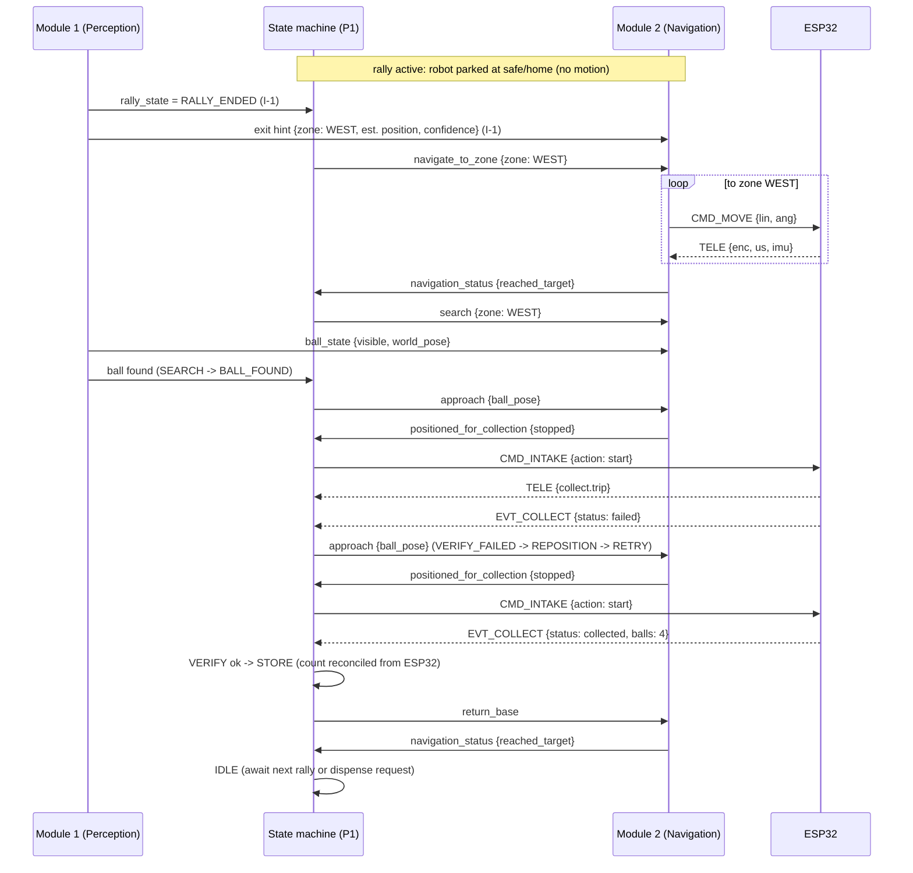

# AI-Sports-Ball-Recovery-Robot — Team Interface Contract

**Version:** 1.0
**Status:** Draft for team review

This document defines the **boundaries between the three major functional modules** so that five team members can develop their components independently and integrate them later without ambiguity. It is an *interface* document: it says who provides what to whom, with what content and authority — not how anything is implemented.

---

## 1. Purpose

- Give every team member a precise statement of what their module **provides**, what it **consumes**, and what it does **not own**.
- Define the small set of **cross-module interfaces** that must exist before the MVP can work end to end.
- Establish **data/decision ownership** so every piece of information has exactly one authoritative source.
- Provide **change-control rules** so interfaces can evolve without breaking parallel development.

## 2. Relationship to the Other Documents

| Document | Defines | Question it answers | Keep in sync |
|---|---|---|---|
| `ARCHITECTURE.md` | System decomposition, responsibilities of laptop vs. ESP32, state machine, modules, MVP scope | **Why** are we building this and **how is the system split**? | Architectural boundaries |
| `TEAM_INTERFACE_CONTRACT.md` (this doc) | Module-to-module boundaries, interface payloads, ownership, change control | **Who hands what to whom** between modules? | Module boundaries and payloads |
| `COMMUNICATION_PROTOCOL.md` | The exact laptop ↔ ESP32 wire protocol: messages, fields, timing, safety, error codes | **How** do the laptop and ESP32 talk byte-for-byte? | Message schemas and safety rules |

**Hierarchy rule:** `COMMUNICATION_PROTOCOL.md` is the single source of truth for everything that crosses the laptop ↔ ESP32 link. `ARCHITECTURE.md` is the source of truth for module and responsibility boundaries. If this document ever conflicts with either, the reference documents win until a change is approved through [Change Control](#11-change-control-for-interfaces).

## 3. The Three Functional Modules

| Module | Repository area | Core responsibility | Primary owner(s) |
|---|---|---|---|
| **Module 1 — AI Game & Environment Perception** | `ai/` | See the game: balls, obstacles, court, rally state, exit estimation | Person 2 (AI & Computer Vision) |
| **Module 2 — Autonomous Navigation & Intelligent Search** | `navigation/` | Get the robot where it needs to go, safely and efficiently | Person 3 (Navigation & Robotics Software) |
| **Module 3 — Ball Acquisition, Storage & Replenishment** | `firmware/`, `mechanical/` | Physically collect, verify, store, and dispense balls | Person 5 (embedded actuation/firmware), Person 4 (mechanism), orchestration by Person 1 |

The laptop-side **state machine and recovery orchestration** (Person 1, System Architecture & Integration Lead) is not a fourth module: it is the integration layer that coordinates the three modules using the interfaces below.

*Note:* Module 3's physical mechanism (Person 4) and its ESP32 firmware (Person 5) implement the intake, verification sensor, storage bin, and dispensing gate. Its interface to the laptop side is the protocol command/event set orchestrated by Person 1 (see §5, I-6/I-7).

## 4. Module Responsibilities in Detail

### Module 1 — AI Game & Environment Perception (`ai/`)

**Owner:** Person 2. **Interface sign-off:** Person 1 (semantics of rally/exit events affect the state machine).

**Provides**
- Ball detection and tracking: ball-visible events with position, velocity estimate when reliable, and `BALL_LOST` / last-known-pose when tracking is lost.
- Court boundary understanding and rally-state classification (`RALLY_ACTIVE`, `RALLY_ENDED`) per `ARCHITECTURE.md` §9.
- Ball exit / recovery-zone estimate on rally end: `exit_zone`, `estimated_ball_position`, `confidence` (per §6.4).
- Person/obstacle detections from the camera (people, chairs, tables, bags).

**Consumes**
- Robot system state (IDLE vs. active) from the state machine — perception arms/disarms rally monitoring accordingly.
- Camera calibration / court-map parameters supplied by integration (Person 1). Perception reports world-frame outputs in the agreed frame (§6.1).

**Does NOT own**
- Robot motion decisions, obstacle avoidance responses, or search planning.
- Motor, intake, or dispensing actuation; any laptop ↔ ESP32 traffic for actuation.
- Robot pose estimation or motor-state interpretation (Module 2 / ESP32).

**Interface principles**
- Perception publishes state and events (on detection change); it never blocks on or is blocked by consumers.
- All outputs carry a timestamp and a confidence value where meaningful; consumers decide what to trust.
- Perception never issues movement, intake, or dispensing commands (see Rule R-3, §8).

### Module 2 — Autonomous Navigation & Intelligent Search (`navigation/`)

**Owner:** Person 3. **Interface sign-off:** Person 1 (task directives and status events), Person 4 (approach geometry for collection).

**Provides**
- Localization: robot pose estimate from encoder odometry + IMU heading (`TELE.enc`, `TELE.imu`).
- Path planning and velocity generation to reach any target (zone, ball, base).
- Obstacle avoidance and dynamic rerouting from ultrasonic distances (`TELE.us`) plus camera obstacle detections (Module 1).
- Recovery-zone targeting, intelligent search within a zone, and search expansion behavior.
- Approach behavior for ball collection, terminating at the agreed intake pose (see §12 open decision 4).
- Return-to-base behavior.
- Movement to the ESP32 via `CMD_MOVE` / `CMD_STOP` — the only normal source of motion commands (per `COMMUNICATION_PROTOCOL.md` §12, Person 3 owns laptop-side motion).
- Navigation-status events to the state machine (arrived at zone/target, stopped, replanned around obstacle, search exhausting a zone).

**Consumes**
- Task directives from the state machine (which zone, search vs. approach, return to base).
- Ball state and camera obstacle detections from Module 1.
- Exit search hint (I-1): `exit_zone`, `estimated_ball_position`, `confidence` — used to prioritize the search around the estimated position (§6.4).
- ESP32 telemetry (`TELE.enc`, `TELE.us`, `TELE.imu`, `TELE.mot`) for localization, obstacle logic, and motion-health monitoring.

**Does NOT own**
- Rally state, exit estimation, or what a "ball" is (Module 1).
- Collection verification, storage count, or dispensing (Module 3 / ESP32).
- Low-level motor control (PWM, speed loop) — that is the ESP32's job.

**Interface principles**
- Navigation treats the world in agreed world-frame coordinates only; it does not interpret raw camera pixels.
- Navigation produces a continuous stream of velocity commands (≤ 20 Hz per protocol §8) and never leaves the robot moving without an active intent to move.
- Navigation never touches intake/dispense/reset commands.

### Module 3 — Ball Acquisition, Storage & Replenishment (`firmware/`, `mechanical/`)

**Owners:** Person 4 (mechanism), Person 5 (ESP32 firmware). Laptop-side orchestration of collection/retry and count tracking: Person 1 (per `COMMUNICATION_PROTOCOL.md` §12 and `ARCHITECTURE.md` §9/§11).

**Provides**
- Intake mechanism and drive: front roller, guide plates/funnel (mechanical, Person 4).
- Collection verification sensor reading (`TELE.collect.trip`) and collection result events (`EVT_COLLECT`) per protocol §10.
- Storage bin with capacity and authoritative stored-ball count (`TELE.balls`, updated on `EVT_COLLECT` / `EVT_DISPENSE`).
- Servo dispensing gate and dispense result events (`EVT_DISPENSE`).
- Mechanical constraints for approach (intake standoff, orientation, aperture) consumed by Module 2 planning.

**Consumes**
- Laptop commands: `CMD_INTAKE`, `CMD_DISPENSE`, `CMD_RESET` (from the state machine / Person 1 orchestration).
- Safe-stop and latching rules from protocol §7 (e-stop, comms loss, local obstacle hard stop).
- Power and mechanical mounting decisions (internal to the module owners).

**Does NOT own**
- When to collect or dispense (state machine decision), approach maneuvers (Module 2), or rally/perception logic.
- Route planning, recovery-zone selection, or any robot movement.

**Interface principles**
- All actuation and verification logic is ESP32-local per protocol §10; the mechanism never moves the robot.
- Events are pushed as they happen; counts are authoritative on the ESP32 (protocol §10) and are reconciled by the laptop, not invented there.
- Mechanical geometry changes that affect approach or verification must go through change control (§11) because they ripple into Module 2 and the protocol's `TELE.us` / `collect` layout.

## 5. Key Cross-Module Interfaces

Every interface below lists its **logical payload**. Where an interface crosses to the ESP32, the exact wire schema is defined in `COMMUNICATION_PROTOCOL.md` and is *not* repeated here. Payload forms governed by the agreed conventions in §6 (world frame, zone vocabulary, exit hint) are **frozen**. Field names still marked *indicative* depend on the remaining open decisions in §12 and must not be coded against.

### I-1 Perception → State machine & Navigation (rally, exit, search hint)

| | |
|---|---|
| Producer / Consumer | Module 1 (Person 2) → State machine (Person 1) and Module 2 (Person 3) |
| Trigger | On rally-state change and on exit estimation |
| Payload | `rally_state` (`RALLY_ACTIVE` / `RALLY_ENDED`); on rally end with the ball out of play: `exit_zone` (`WEST` / `EAST` / `NORTH` / `SOUTH`), `estimated_ball_position` { x, y } in meters (world frame), `confidence` — frozen per §6.1, §6.3, §6.4 |
| Notes | Drives `RALLY_ACTIVE → RALLY_ENDED → PREDICT_EXIT_ZONE` transitions (`ARCHITECTURE.md` §9). During `RALLY_ACTIVE` the robot stays at its safe/home position. `estimated_ball_position` is a search hint, not ground truth (§6.4); Module 2 uses it only within tasks the state machine directs |

### I-2 Perception → Navigation (ball & obstacles)

| | |
|---|---|
| Producer / Consumer | Module 1 (Person 2) → Module 2 (Person 3) |
| Trigger | Ball tracking updates (≤ vision rate), obstacle detections, ball lost |
| Payload | `ball_state` { visible, world_pose { x, y } in meters (§6.1), velocity (optional), confidence, ts }; `ball_lost` { last_known_pose, ts }; `camera_obstacles` [ { type, world_region, ts } ] — ball world-frame form frozen (§6.1); obstacle `world_region` form *indicative* until §12 open decision 2 |
| Notes | Enables approach, search hints, and fused obstacle awareness. Only Module 1 may declare a ball "found" for the `SEARCH → BALL_FOUND` transition; the trust threshold is §12 open decision 1 |

### I-3 System state machine → Navigation (task directives)

| | |
|---|---|
| Producer / Consumer | State machine (Person 1) → Module 2 (Person 3) |
| Trigger | State transitions: `PREDICT_EXIT_ZONE`, `BALL_FOUND`, `VERIFY_FAILED → REPOSITION`, `RETURN_BASE`, abort |
| Payload | `navigate_to_zone` { zone }; `search` { zone, max_extent }; `approach` { ball_pose }; `return_base` {}; `stop` {} — `zone` uses the agreed vocabulary `WEST` / `EAST` / `NORTH` / `SOUTH` (§6.3); directive set and remaining fields *indicative* until §12 open decision 3 |
| Notes | Directives select the *behavior*; Module 2 owns how to execute it (paths, patterns, speeds), using the latest exit hint (I-1, §6.4) to prioritize the search start inside the directed zone |

### I-4 Navigation → System state machine (status)

| | |
|---|---|
| Producer / Consumer | Module 2 (Person 3) → State machine (Person 1) |
| Trigger | On arrival, stop, replan, search-zone exhaustion, faults |
| Payload | `navigation_status` { behavior, reached_target, replanned (reason), search_zone_exhausted, ts } |
| Notes | Supports `NAVIGATE_TO_ZONE → SEARCH`, `SEARCH → EXPAND_SEARCH`, `RETURN_BASE → IDLE`, and obstacle-replan event handling |

### I-5 Navigation → Ball Acquisition handoff (via state machine)

| | |
|---|---|
| Producer / Consumer | Module 2 (Person 3) → State machine (Person 1) → Module 3 actuation |
| Trigger | `APPROACH` completes: robot stopped at the agreed intake pose |
| Payload | `positioned_for_collection` { pose, stopped: true } (logical handoff — no wire message; the state machine gates `COLLECT` on it) |
| Notes | The exact intake pose (standoff/orientation) depends on mechanism geometry — §12 open decision 4 |

### I-6 Acquisition result → System (and Navigation where relevant)

| | |
|---|---|
| Producer / Consumer | ESP32 (Person 5) → State machine (Person 1); Module 2 informed when a re-approach is ordered |
| Trigger | End of each intake run; each dispense request |
| Payload | Wire messages `EVT_COLLECT` { status: `collected` \| `failed`, balls }; `EVT_DISPENSE` { status: `ok` \| `failed` \| `empty`, balls } (schemas per protocol §4.2 — not duplicated here) |
| Notes | Drives `COLLECT → VERIFY`, `VERIFY → STORE`, and the `VERIFY_FAILED → REPOSITION → RETRY` recovery loop (`ARCHITECTURE.md` §9) |

### I-7 Laptop ↔ ESP32 (movement, telemetry, acquisition, safety)

| | |
|---|---|
| Producer / Consumer | See table below; **transport contract: `COMMUNICATION_PROTOCOL.md` only** — no side channels |
| Content | See below |

| Direction | Information | Producer → Consumer | Wire messages |
|---|---|---|---|
| Laptop → ESP32 | Movement commands | Module 2 → ESP32 | `CMD_MOVE`, `CMD_STOP` (normal) |
| Laptop → ESP32 | Stop/emergency (safety) | State machine / safety layer → ESP32 | `CMD_STOP` (emergency), per protocol §7 |
| Laptop → ESP32 | Acquisition commands | State machine orchestration → ESP32 | `CMD_INTAKE`, `CMD_DISPENSE`, `CMD_RESET` |
| Laptop → ESP32 | Liveness | Laptop link layer → ESP32 | `HEARTBEAT` |
| ESP32 → Laptop | Navigation telemetry | ESP32 → Module 2 | `TELE` (`enc`, `us`, `imu`, `mot`) |
| ESP32 → Laptop | Acquisition/system telemetry | ESP32 → State machine | `TELE` (`collect`, `balls`, `faults`), `EVT_COLLECT`, `EVT_DISPENSE`, `EVT_FAULT` |
| ESP32 → Laptop | Boot + liveness | ESP32 → Laptop link layer | `EVT_BOOT`, `HEARTBEAT` |

*Command acknowledgements (`RESP_OK` / `RESP_ERR`), sequence numbers, timeouts, and latching behavior: protocol §3, §7, §9. Response ownership on the laptop side (who consumes `RESP_*`) is §12 open decision 6.*

## 6. Agreed Conventions — Coordinate System, Operating Area & Recovery Zones

The team has agreed the following decisions. They are **authoritative**: they resolve the former open decisions on *coordinate conventions* and *form of the exit-zone estimate* (removed from §12) and **freeze** the §5 payloads that depend on them. Anything governed by this section may be coded against; anything in §5 still marked *indicative* may not.

### 6.1 World coordinate system

- A fixed, global **2D Cartesian world frame**. The origin does **not** move with the robot.
- **Origin (0, 0):** the fixed physical court corner **nearest the designated HOME/BASE location**.
- **+X axis:** along the **20 m length** of the padel court. **+Y axis:** across the **10 m width** of the padel court.
- **Units:** meters.
- **Robot pose:** (x, y, θ). **Ball position:** (x, y).
- **Negative coordinates are valid.**
- The frame is independent of the size of the surrounding operating/recovery area (§6.2) — no world boundary is part of this definition.

### 6.2 Court vs. operating area

- The **20 m × 10 m padel court** is a known rectangular region *inside* the larger operating environment — it is not the robot's operating boundary.
- The robot is expected to operate **outside the court** to recover balls.
- The surrounding recovery/operating area is **configurable**, not fixed by the coordinate-system definition. The initial target supports roughly **20 m of recovery travel outward from the court** where the physical environment permits, and the design stays extensible to larger areas (e.g., 30 m or more) **without changing the coordinate-system convention**.
- No 20 m or 30 m world boundary is hard-coded into the coordinate-system definition; the boundary is a venue configuration.

### 6.3 Recovery zones

- Four **logical recovery/search zones**: `WEST`, `EAST`, `NORTH`, `SOUTH` (named relative to the world frame of §6.1).
- They are **logical search regions, not permanently hard-coded physical rectangles**.
- Their actual physical boundaries remain **configurable** and may depend on the testing venue/layout.
- Exact zone dimensions are deliberately **not defined** here; they will be fixed as venue configuration once the testing venue is known — not as an interface or convention change.

### 6.4 AI → Navigation exit information

When a rally ends and Module 1 determines that a ball has left the playable area, it provides Navigation with:

- `exit_zone` — one of `WEST` / `EAST` / `NORTH` / `SOUTH` (§6.3)
- `estimated_ball_position` — (x, y) in meters in the world frame (§6.1)
- `confidence`

**The estimated position is a search hint, not guaranteed ground truth.** Navigation:

- prioritizes the estimated position when confidence is useful;
- searches **around** that estimated position;
- expands the search if the ball is not found;
- uses a **broader/systematic search** when confidence is low.

What counts as "useful" vs. "low" confidence is a numeric threshold to be tuned during field testing — a calibration parameter, not an interface definition.

### 6.5 What this section does NOT decide

Four distinct concerns must not be conflated:

| Concern | Defined by | Status |
|---|---|---|
| Coordinate-system convention | §6.1 | Agreed — the frame all modules report positions in |
| Operating-area boundary | §6.2 | Agreed convention; the concrete boundary is venue configuration |
| Recovery-zone configuration | §6.3 | Agreed logical zones; physical extents are venue configuration |
| Robot localization | Module 2 (Person 3) | **Not solved here** — estimating the robot's own (x, y, θ) in the agreed frame stays Module 2's job (odometry + IMU via `TELE.enc` / `TELE.imu`); fidelity limits remain an `ARCHITECTURE.md` open decision |

Defining the coordinate system does **not** automatically solve robot localization.

## 7. Data & Decision Ownership

Each row has exactly **one authoritative owner**; everyone else treats the datum as read-only input.

| Data / decision | Authoritative source | Reported / shared via | Consumed by |
|---|---|---|---|
| Ball detection / location | Module 1 (Person 2) | I-2 `ball_state` | Module 2 (approach, search hints), state machine |
| Ball "found" decision (`SEARCH → BALL_FOUND`) | Module 1 (Person 2), threshold per §12 open decision 1 | I-2 | State machine |
| Rally state | Module 1 (Person 2) | I-1 | State machine (owns transitions) |
| Exit estimate / search hint | Module 1 (Person 2) — `exit_zone`, `estimated_ball_position`, `confidence` (payload per §6.4) | I-1 | State machine (recovery-task selection), Module 2 (search prioritization) |
| Recovery-zone **selection** (zone IDs per §6.3) | State machine (Person 1) + Module 2 targeting | I-3, I-4 | Module 2 execution |
| Navigation state (behavior, replans, search progress) | Module 2 (Person 3) | I-4 | State machine |
| Robot pose (localization) | Module 2 (Person 3) — fuses ESP32 raw data; the agreed world frame (§6.1) does not by itself produce a pose estimate (§6.5) | internal + I-4 | Module 1 (court-relative context), state machine |
| Obstacle awareness | Camera part: Module 1; distance part: ESP32 raw (`TELE.us`); fused decisions: Module 2 | I-2, `TELE.us` | Module 2 (avoidance/rerouting) |
| Motor state | ESP32 (Person 5) — physical truth | `TELE.mot` | Module 2 (motion-health check), state machine |
| Encoder readings | ESP32 (Person 5) — raw counts | `TELE.enc` | Module 2 (odometry integration) |
| Collection result | ESP32 (Person 5) — verification sensor | `EVT_COLLECT` | State machine (`VERIFY`, retry loop) |
| Stored-ball count | ESP32 (Person 5) — authoritative (protocol §10) | `EVT_COLLECT` / `EVT_DISPENSE` / `TELE.balls` | State machine (laptop copy reconciled from telemetry) |
| Dispense result | ESP32 (Person 5) | `EVT_DISPENSE` | State machine (replenishment flow) |
| Faults (latched) | ESP32 (Person 5) | `EVT_FAULT`, `TELE.faults` | State machine (fault handling), Module 2 (motion gating) |

## 8. Interface Design Rules

- **R-1 — Modules communicate only through defined interfaces.** No module reads or writes another module's internal state, and no module talks to the ESP32 except through the protocol messages allocated to it in §5 (I-7).
- **R-2 — No dependence on another module's internal implementation.** An owner may refactor internals freely as long as their interface contracts (payload, authority, timing) are honored. Interface changes require §11 change control.
- **R-3 — The AI/perception module must not directly control motors.** Module 1 never issues movement commands of any kind. Normal motion flows exclusively through Module 2 (`CMD_MOVE`/`CMD_STOP`); only the state-machine/safety layer may additionally issue an emergency `CMD_STOP` as a fail-safe (protocol §7).
- **R-4 — Navigation owns route planning, not low-level motor control.** Module 2 decides paths and velocities; the ESP32 owns PWM generation and the closed-loop speed control.
- **R-5 — The ESP32 owns low-level real-time control.** Motor speed loops, sensor sampling, intake/dispense actuation, verification sensing, and local fail-safes are ESP32-local (`ARCHITECTURE.md` §3). The laptop never sends PWM or raw actuator signals.
- **R-6 — The communication protocol is the single source of truth for laptop ↔ ESP32 transport.** No extra wire messages, side channels, or ad-hoc formats without a protocol version change (§13 of `COMMUNICATION_PROTOCOL.md`) approved per §11 below.
- **R-7 — One authoritative owner per datum** (§7). Producers push; consumers never "correct" authoritative data locally except by agreed reconciliation (e.g., ball count).
- **R-8 — Producers never block on consumers; consumers tolerate gaps.** Missing telemetry/heartbeats are normal (protocol §8); consumers must handle stale or missing data with the protocol's timeouts rather than assuming freshness.
- **R-9 — Shared conventions are explicit and frozen.** Coordinate frames, units, and zone/event names are the agreed terms defined in §6. Payloads governed by §6 are frozen and may be coded against; payloads still marked *indicative* (see §12) must not be coded against until their open decision is resolved.
- **R-10 — Safety rules are not bendable by interface convenience.** Latching, re-arm, and fail-safe behavior in protocol §7 apply unchanged regardless of module urgency.

## 9. Minimum MVP Interface Set

The MVP (per `ARCHITECTURE.md` §13) is achievable with interfaces I-1…I-7 plus the baseline ESP32 telemetry and safety link. The checklist:

| MVP capability | Required interfaces | Notes |
|---|---|---|
| Rally monitoring + rally-end detection | I-1 | Robot parked at safe/home during `RALLY_ACTIVE` |
| Exit-side estimation | I-1 | Exit hint (`exit_zone` + `estimated_ball_position` + `confidence`, §6.4) feeds zone targeting and search prioritization |
| Targeted recovery-zone navigation | I-3, I-4, I-7 (`CMD_MOVE`/`CMD_STOP`, `TELE`) | Zone → pose → velocities |
| Obstacle detection / avoidance | I-2 (camera), `TELE.us`, I-4 (replan) | Module 2 fuses; ESP32 hard-stop is a backstop |
| Ball search + expansion | I-3 (`search`), I-4 (`search_zone_exhausted`) | `SEARCH ↔ EXPAND_SEARCH` loop |
| Ball found / approach | I-2 (`ball_state`), I-3 (`approach`) | `SEARCH → BALL_FOUND → APPROACH` |
| Physical collection + verification | I-5, I-6 (`CMD_INTAKE`, `EVT_COLLECT`) | `COLLECT → VERIFY` |
| Storage + capacity | I-6 (`EVT_COLLECT.balls`), `TELE.balls` | ESP32-authoritative count; `full` → return base |
| Return to base | I-3 (`return_base`), I-4 | `RETURN_BASE → IDLE` |
| Ball dispensing | I-6 (`CMD_DISPENSE`, `EVT_DISPENSE`) | At the designated dispensing location |
| Safety (e-stop, comms loss, reset) | I-7 (`CMD_STOP` emergency, `CMD_RESET`), protocol §7 | Always present, from day one of bench testing |

**Minimum acceptance statement:** when the table above works end to end without hand intervention (except e-stop and re-arm), the MVP interface set is complete.

## 10. End-to-End Data-Flow Example

One full recovery cycle with a single collection failure and retry:

*Dispensing follows the same pattern at base: `CMD_DISPENSE` → `EVT_DISPENSE`, with the state machine only commanding when parked at the designated dispensing location (protocol §10).*

## 11. Change Control for Interfaces

1. **What counts as an interface change:** any change to a payload in §5, an agreed convention in §6, an ownership row in §7, an interface rule in §8, the MVP set in §9, or — for wire messages — anything in `COMMUNICATION_PROTOCOL.md`.
2. **Proposal:** the requesting owner documents the change, the reason, and the impact on every consumer named in §5/§6.
3. **Sign-off:** Person 1 (integration) plus every affected module owner must approve. Person 4 is consulted whenever mechanism geometry is touched. Person 5 is consulted whenever ESP32-side behavior is touched.
4. **Documentation:** approved changes update this document and, where applicable, `COMMUNICATION_PROTOCOL.md` (following its §13 version policy) and `ARCHITECTURE.md` if module boundaries change. The three documents are always updated in the same change.
5. **Prefer additive changes:** new optional payload fields or new messages are preferred over renaming/removing, so owners can integrate incrementally.
6. **No unilateral changes:** a module owner may never change an interface others consume without sign-off, no matter how convenient.
7. **Versioning:** this document follows `MAJOR.MINOR` — MINOR for additive/clarifying changes, MAJOR for changes that break existing consumers. Current version: 1.0.

## 12. Open Interface Decisions (need team agreement before implementation)

These are deliberately **not decided here** — they are genuinely open in `ARCHITECTURE.md` / `COMMUNICATION_PROTOCOL.md` and need team agreement (and in some cases field data) before the remaining *indicative* payloads in §5 can be frozen. Coordinate conventions and the form of the exit estimate are now agreed and authoritative in §6 — they are no longer open.

1. **Ball-world-pose derivation and the "found" threshold** — how Module 1 converts image detections to world pose (ground-plane assumption, calibration) and how many consistent detections qualify as `BALL_FOUND`. The world-frame output form is fixed (§6.1); the derivation and the threshold are what remain open. Needs dataset and field testing.
2. **Camera obstacle delivery form** — list of typed world regions (I-2) vs. another agreed form, and how Module 2 fuses them with `TELE.us` distances. The world frame itself is fixed (§6.1); the delivery form is still open. Module 2 internal until the form is agreed.
3. **Search coordination split** — which search behaviors the state machine commands explicitly (directives) vs. which Module 2 chooses internally (within the directed zone, guided by the exit hint of §6.4). Person 1 + Person 3 to agree so I-3/I-4 stay minimal.
4. **Intake pose definition** — standoff distance, orientation tolerance, and final stopping behavior for `approach`, dictated by Module 3 mechanism geometry (Person 4) and the verification sensor placement (protocol §14 open decision 4).
5. **Perception → reaction latency budget** — how stale `ball_state` / obstacle data may be before Module 2 must abort or stop; to be measured, not guessed.
6. **Laptop-side response ownership** — which laptop component consumes `RESP_OK` / `RESP_ERR` for each command class (motion vs. acquisition vs. reset) and how command failures surface to the state machine.

Until each remaining item is resolved, the corresponding §5 payload stays *indicative*: do not code against it. Payloads frozen by §6 (world frame, zone vocabulary, exit hint) are excluded.

---

**Version history**

| Version | Date | Summary |
|---|---|---|
| 1.0 | (draft) | Initial interface contract for team review |